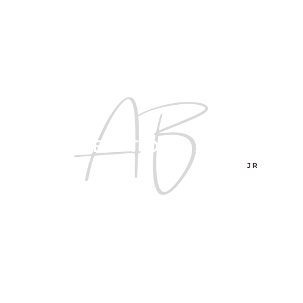

# <p align="center"></p>
# <p align="center">Alberto Banos Jr</p>

<p align="center">
  <strong>Operations & Customer Solutions Lead • Private Contractor • NYC</strong>
</p>

<p align="center">
  <a href="https://albertoportfolio-five.vercel.app">View Live Portfolio</a> •
  <a href="mailto:alberto.banos@yahoo.com">Contact Me</a>
</p>

---

## 🚀 About Me
I am a results-driven professional based in **New York** specializing in high-pressure operations and client relations. I am known for taking control of tough situations, communicating clearly, and delivering solutions that protect customer trust and company reputation.

## 🛠️ Expertise & Skills
* **Leadership**: Situational control, team direction, and accountability under pressure.
* **Customer Solutions**: De-escalation, conflict resolution, and trust-building.
* **Operations**: Logistics coordination, estimates, and time-sensitive execution.
* **Technical**: Hands-on background in construction support, painting, and wiring.

## 📈 Career Highlights
* **Operations Lead @ Sophisticated Moves LLC**: Leading relocations and managing high-stress customer scenarios with consistent 5-star reviews.
* **Top Seller @ Verizon Business Services**: Ranked as a top seller in Manhattan while maintaining high customer satisfaction.
* **Private Contractor**: Partnered with firms like Piece of Cake Moving & Storage to resolve unforeseen logistical challenges.

## 💻 Technical Stack (Portfolio)
This portfolio was built using modern web technologies to ensure speed and a seamless user experience:
* **Framework**: [React 19](https://react.dev/)
* **Build Tool**: [Vite](https://vitejs.dev/)
* **Routing**: [React Router 7](https://reactrouter.com/)
* **Form Handling**: [Formspree](https://formspree.io/)
* **Styling**: Custom CSS with Glassmorphism aesthetic

## 📂 Project Structure
```text
alberto-portfolio/
├── public/          # Static assets (Logo, Resume PDF)
├── src/
│   ├── components/  # Reusable UI components
│   ├── pages/       # Home, Resume, and Contact pages
│   └── App.css      # Custom glassmorphism styling
├── index.html       # Entry point with SEO meta tags
└── package.json     # Project dependencies